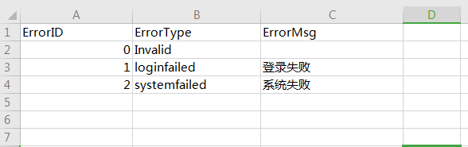
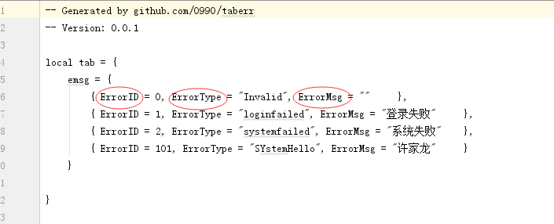

# taberr
客户端,服务端定义消息错误枚举表格数据导出

# 导出步骤

## 准备电子表格

格式参照:example/sample.xlsx

### 表头:
错误ID名称,错误Type名称,错误描述名称

这样导出后的lua文件里的名称就是你定义的

### 表中数据:
错误ID码，int型，必填，会自动校验重复
错误Type,string型，枚举类型，必填，会自动校验重复
错误描述Msg,string型，用于客户端展示用,可不填

##生成

### 简单范例

参照example/run.bat

taberr Sample.xlsx

### 自定义输出
参照example/runParams.bat

taberr -package packageName -enum_name enumName -proto_out output/err.proto -lua_out output/err.lua Sample.xlsx

参数说明
-package 包名
-enum_name 枚举名（proto中的枚举类型)
-proto_out proto输出文件
-lua_out lua输出文件

# 备注
具体使用可参照sample目录
代码借鉴于github.com/davyxu/tabtoy 一个很不错的表格配置导出工具
