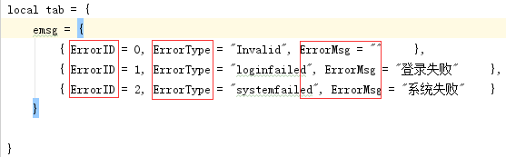

# taberr
用于客户端服务端定义消息错误枚举，xlsx自动导出成服务端需要的proto文件和客户端需要的lua文件
原理：sheet中第一行需要定义三个标签，分别为：错误ID名称(示例中ErrorID),错误Type名称(示例中ErrorType),错误描述名称（示例中ErrorMsg)

这样导出后的lua文件里的名称就是你定义的

第一个标签下的数据内容就是错误ID码，int型，必填，会自动校验重复
第二个标签下的数据就是错误Type,就是枚举类型，string型，必填，会自动校验重复
每三个标签下的数据内容是用于客户端展示用，string型，可不填

定义好数据后命令行中打出最简命令taberr XX.xlsx即可生成相应文件
可自定义输出，参数如下
-package 包名
-enum_name 枚举名（proto中的枚举类型)
-proto_out proto输出文件
-lua_out lua输出文件

具体定义使用可参照sample目录
